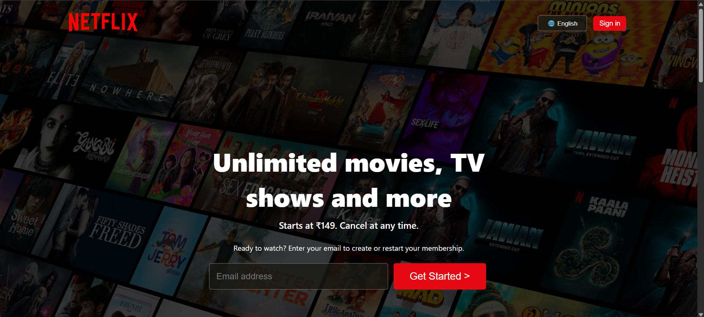
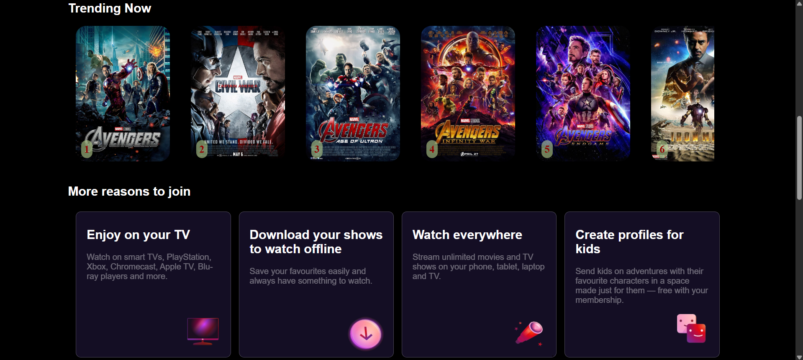
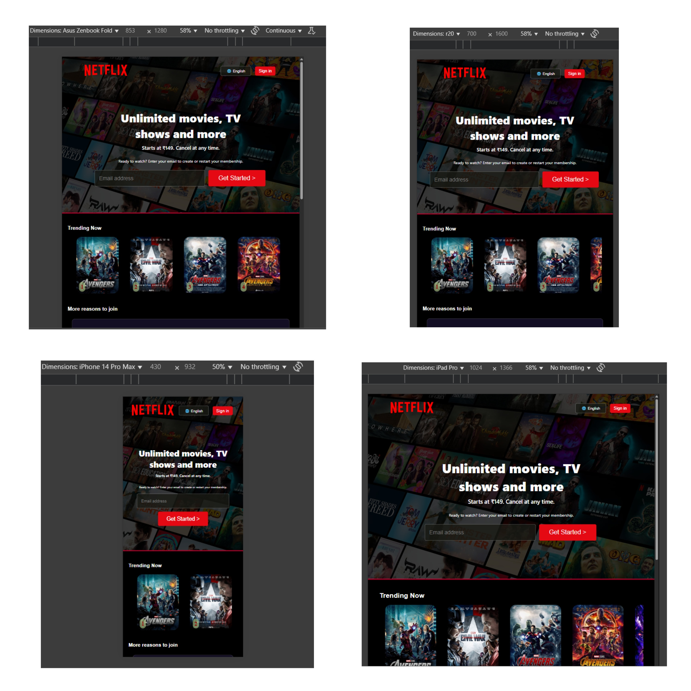

# 📺 Netflix Clone

A responsive front-end **Netflix Clone** built using **HTML5** and **CSS3**. This project replicates the look and feel of the Netflix homepage, including its layout, typography, and basic UI components, optimized for all device sizes.

 <!-- Replace with actual preview image path -->

---

## 🚀 Features

- 🔥 Clean and modern Netflix-inspired UI
- 📱 Fully responsive design (mobile, tablet, desktop)
- 🎬 Trending movies slider section
- 🎯 Interactive email capture form
- ❓ Frequently Asked Questions (FAQs)
- 📥 Ready-to-join and login sections
- 🌐 Multilingual dropdown simulation

---

## 🛠 Tech Stack

- **HTML5** – for semantic structure
- **CSS3** – for styling and layout (including Flexbox)
- **Responsive Design** – with media queries and flexible units

---

## 📸 Screenshots

| Desktop View | Mobile View |
| ------------ | ----------- |
|  |  |

---

## 📂 Folder Structure

